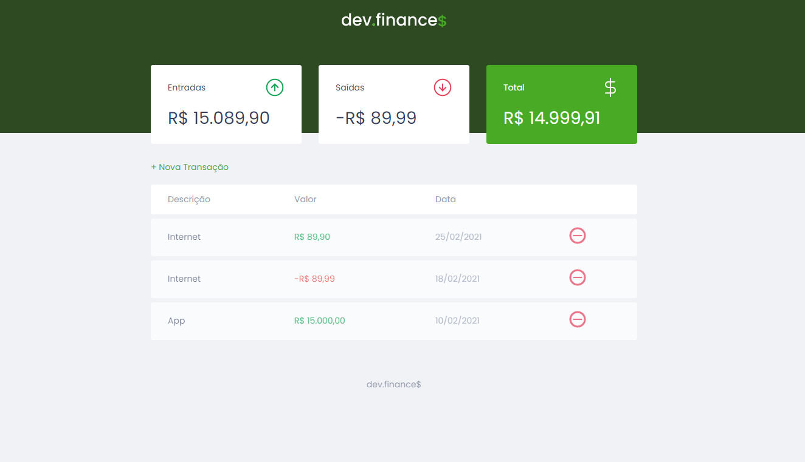
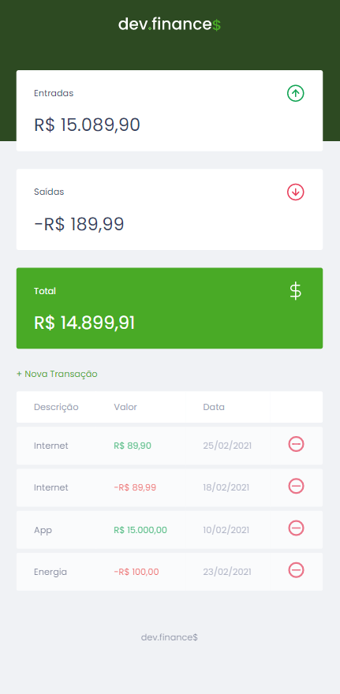
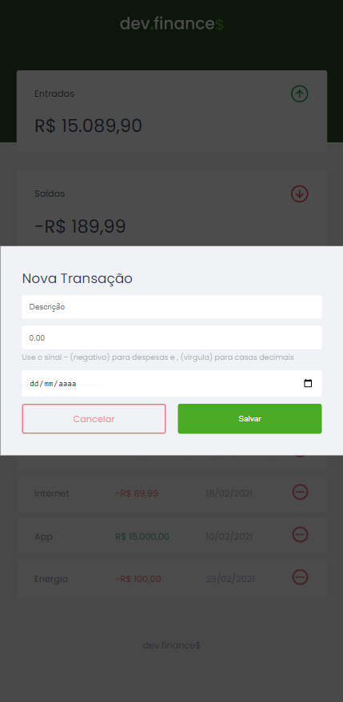
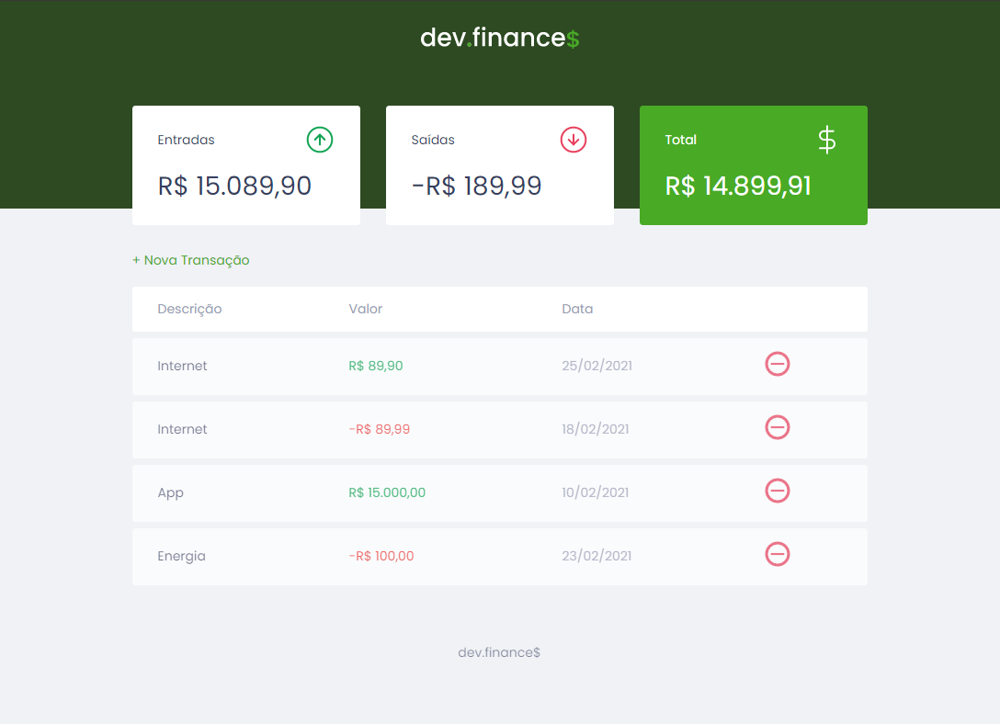
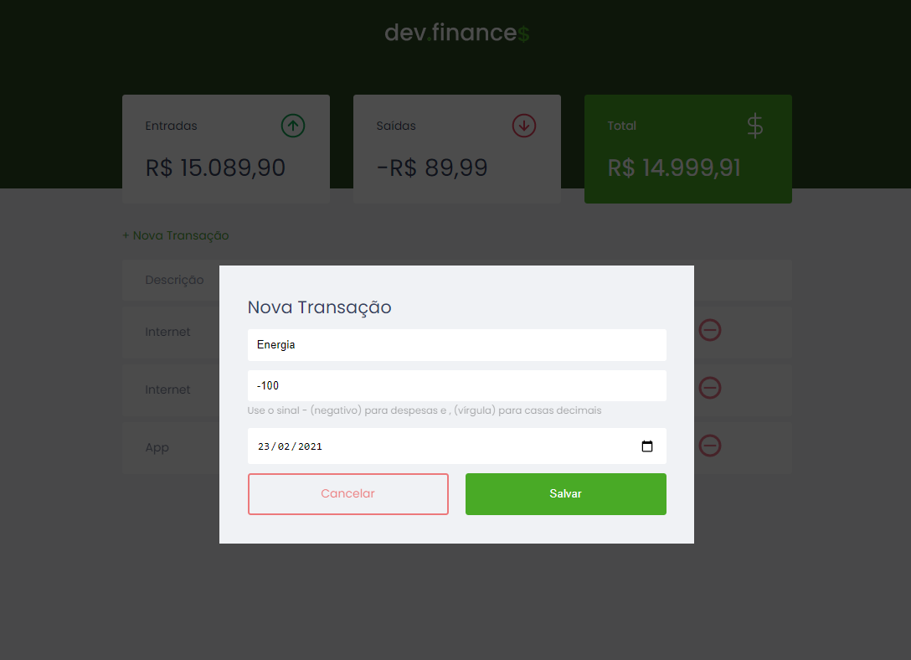

<h1 align="center">dev.finance$</h1>

<h1 align="center">
  
</h1>

## ⚙️ Tecnologias

As seguintes ferramentas foram usadas na construção do projeto: 

- [HTML](#HTML)
- [CSS](#CSS)
- [JavaScript](#JavaScript)

## 💻 Projeto

💸 Projeto simples feito para o seu controle financeiro. 💸

## 🎨 Layout

### Mobile

  

  

### Web

  

  

## 📝 Licença

Este projeto esta sobe a licença MIT.

<h3 align="center">Observação</h3>

Projeto desenvolvido referente a Maratona Discover da Rocketseat 🚀. 

